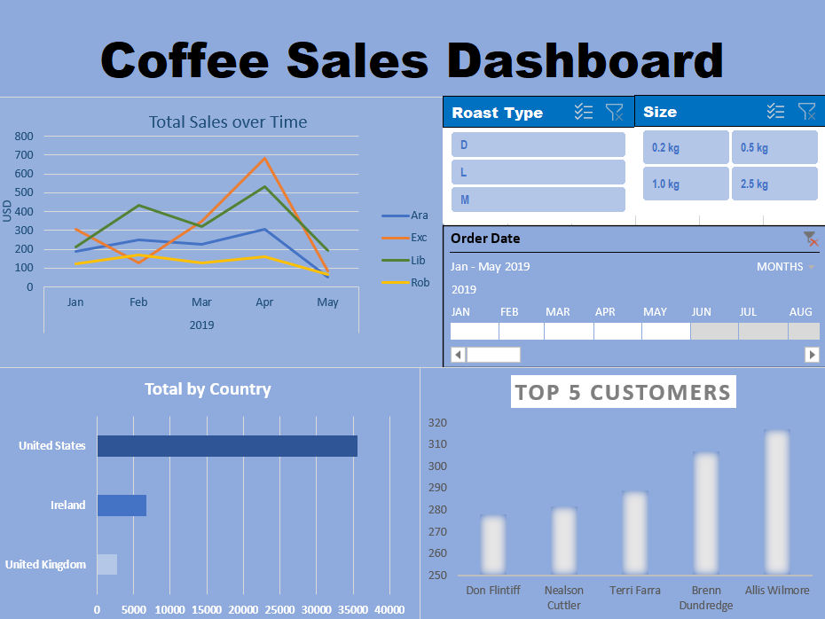

# Coffee Sales Data Analysis Project

This repository contains the code and data files for a data analysis project focused on coffee sales. The project explores various aspects of coffee sales, including order trends, customer behavior, popular coffee types, and more. The dataset used in this analysis includes information such as order ID, order date, customer name, quantity, coffee type, size, unit price, email, and country.

## Dashboard Preview

## Overview

The main goal of this project is to provide insights into coffee sales data that can be used by coffee businesses to make informed decisions.

## Data Source

The dataset used in this project is provided in an Excel format (`coffeeSales.xlsx`). It contains the following columns:

- **Order ID**: Unique identifier for each order.
- **Order Date**: Date when the order was placed.
- **Customer Name**: Name of the customer who placed the order.
- **Quantity**: Quantity of coffee products ordered.
- **Coffee Type**: Type of coffee product ordered.
- **Size**: Size of the coffee (e.g., small, medium, large).
- **Unit Price**: Price per unit of coffee product.
- **Email**: Email address of the customer.
- **Country**: Country where the order was placed.

## Analysis

The analysis is performed using Excel spreadsheet software. The main steps involved in the analysis include:

1. Data Cleaning: Cleaning the data, handling missing values, and formatting columns.
2. Data Exploration: Exploring the dataset to understand its structure, distributions, and relationships between variables.
3. Visualization: Creating visualizations such as bar charts and line charts to illustrate key insights.

## Results

The analysis reveals several interesting insights into coffee sales, including:

- Trends in coffee sales over time.
- Most popular coffee types and sizes.
- Customer demographics and geographic distribution.
- Correlations between variables such as order quantity and unit price.

## Usage

To reproduce the analysis, follow these steps:

1. Download the Excel dataset `coffeeSales.xlsx` from this repository.
2. Open the dataset in Excel or any other compatible spreadsheet software.
3. Navigate through the different sheets and analyze the data.
4. Modify the data or perform additional analysis as needed.

## Data Source

- (@mo_chen1 - instagram)

